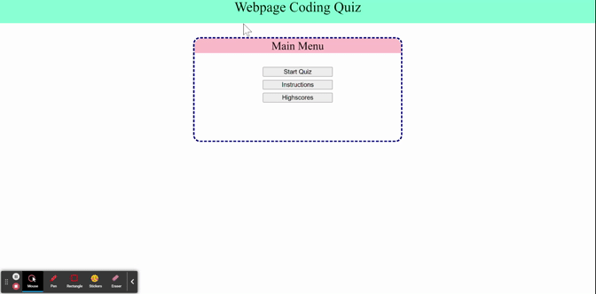

# online-code-quiz

## Summary
 Online quiz about HTML, CSS, and Javascript.

## Technology Used
 - HTML : Use to stucture our website
 - CSS : Use to style our website
 - JS  : Applied javascript web API
 - Git : for version control system to track changes to source code
 - GitHub : hosts the repository that can be deployed to GitHub Pages

## Site Picture


## Deployed Link
https://chanjeff520.github.io/online-code-quiz/

## Instructions
<ol>
<li>The user will have 60 seconds to complete this quiz.</li>
<li>All of the questions answered wrong will detract 10 seconds from the time</li>
<li>Your score will be the amount of time you have left after complete the quiz</li>
</ol>


## Code Snippet
```js

//This function is use to change questions from the quiz page and also remove the prevous questions.
function renderQuiz(){
    //This changes the questions presented in the <p> tag
    document.getElementById("questions").textContent = quiz[quizPage].questions;
    //o1El will make the answers for the questions
    var olEl = document.getElementById("choices");
    for(var i = 0; i<quiz[quizPage].choices.length; i++){
        //creates a list and a button
        var liEl = document.createElement("li");
        var buttonEl = document.createElement("button");

        //makes the text witin the button equal one of the choices from the quiz object
        buttonEl.textContent = quiz[quizPage].choices[i];
        //when the button is click it will either move to the next question if the questions was right or
        // subtract 10 seconds from time move to the next question
        buttonEl.onclick = function(event){
            console.log(event.target);
            if(event.target.textContent == quiz[quizPage].answers){
                quizPage++;
                //removes the questions 
                while (olEl.firstChild){
                    olEl.removeChild(olEl.lastChild);
                }
                //adds new questions if the length of the quizPage is the same as the quiz
                if(quizPage<quiz.length){
                    renderQuiz();
                }
            }else{
                seconds -= 10;
                quizPage++;
                while (olEl.firstChild){
                    olEl.removeChild(olEl.lastChild);
                }
                if(quizPage<quiz.length){
                    renderQuiz();
                }
            }
        }

        // ol <- li <- button
        liEl.appendChild(buttonEl);
        olEl.appendChild(liEl);
    }
}

```
This function above renders and restruction the quiz page from a quiz object that contains all the information to form the quiz page. This function also deletes unuse choices and make ones that aligns with the question.

## Author Links
- [LinkedIn](https://www.linkedin.com/in/jefflchan/)
- [GitHub](https://github.com/chanjeff520)
